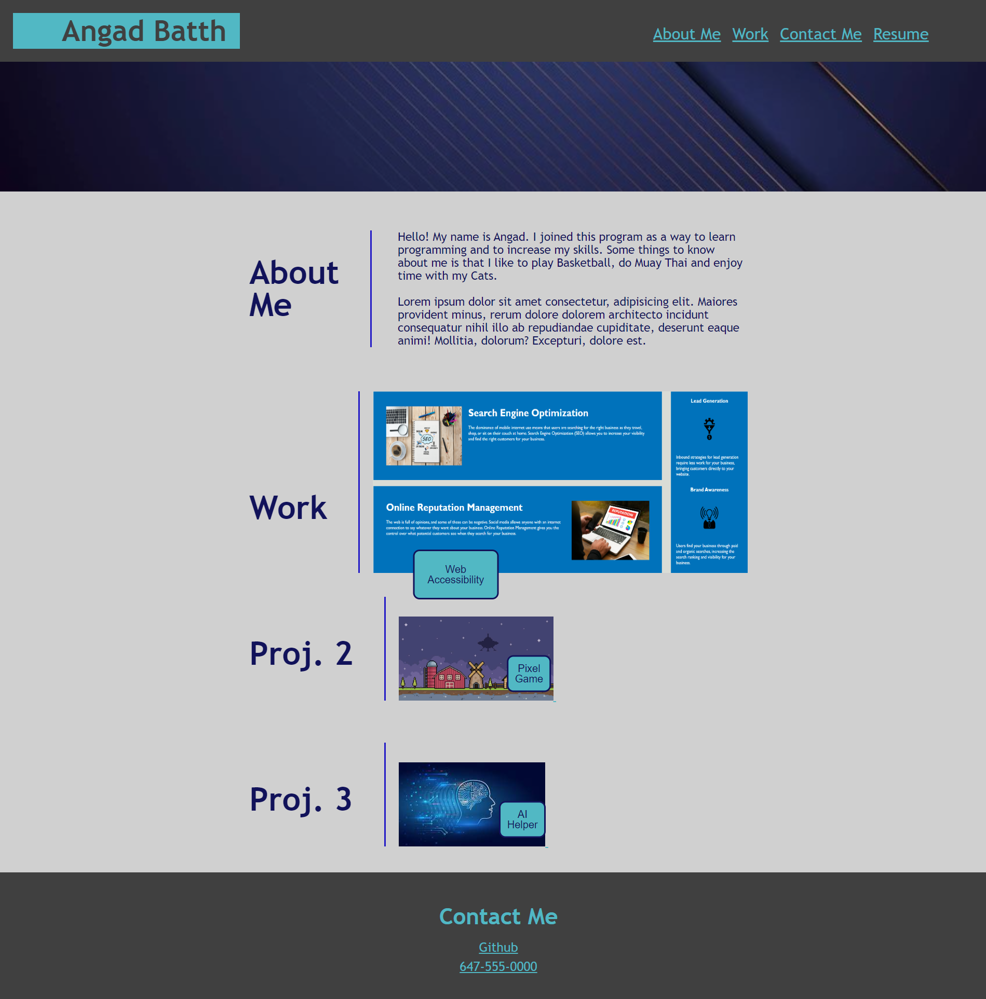

# CSS Portfolio Challenge

## Table of Contents
- [Description](#description)
- [What was learned?](#what-was-learned)
- [Website](#website)
- [Credits](#credits)
 

## Description
This project was built to practice using our CSS knowledge to craft a portfolio website from scratch. 

This was done by first creating a wireframe of how we want the website to look. Followed by HTML to lay out the actual webpage and finally
adding CSS styling to the page.
 

## What was learned?
Throughout the course of this challenge, I had learned how to create a website from nothing. This was a very challenging thing to do for me as it took a lot of time and independent research to get some issues fixed. We also learned how to use hover states to alter elements and how to link websites using pictures rather than text.
 

## Website
[The link to the deployed webpage can be found here](https://angadbatth.github.io/css-portfolio-challenge/)

 

## Credits

[Mozilla Developer](https://developer.mozilla.org/en-US/)  
[W3 Schools](https://www.w3schools.com/)  
[Stack Overflow](https://stackoverflow.com/)  
Daler Singh  
Adam Nyx

